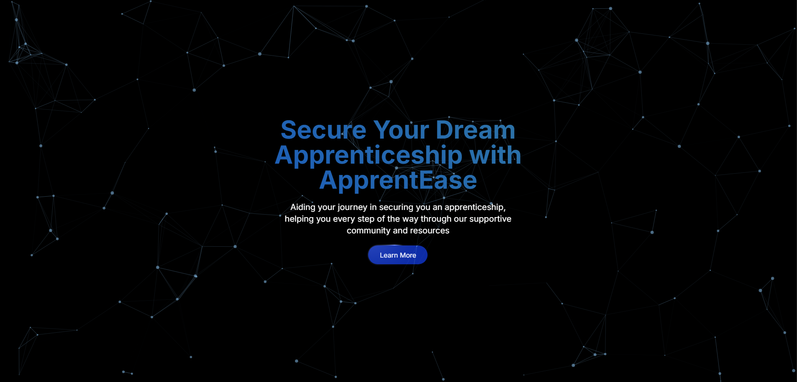
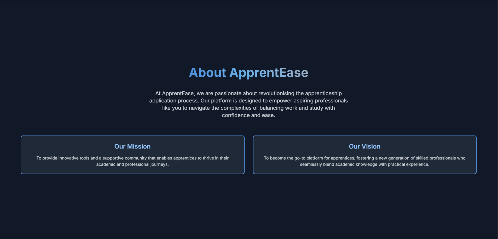
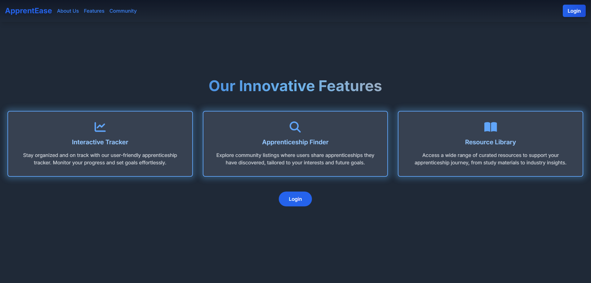
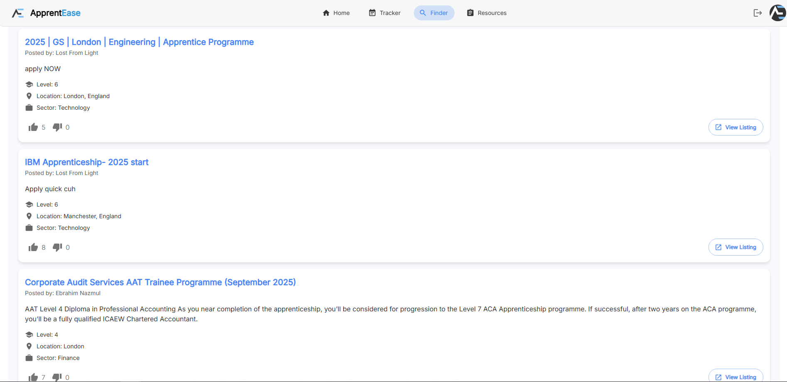
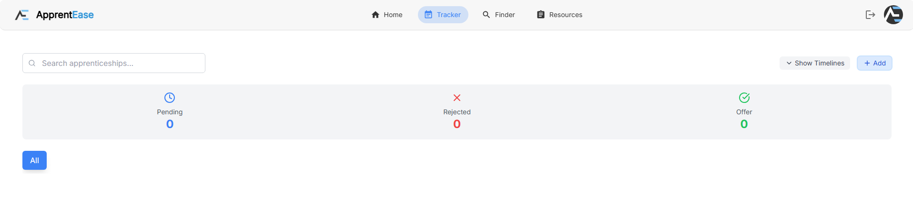
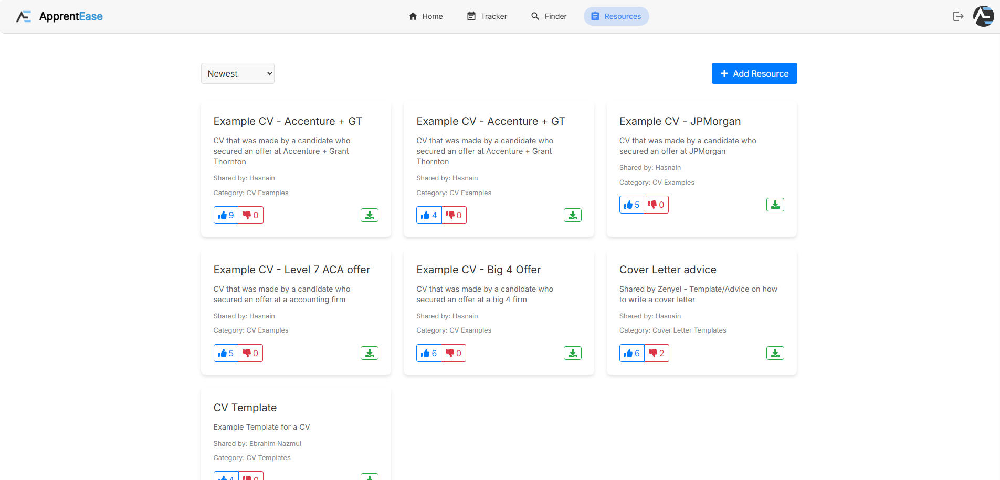

<!-- Badges -->

---

# Community Website — Showcase

> 🔒 **Production source is private.**  
> This public repository contains screenshots and other public demonstrations/code of the ApprentEase community website (apprentease.co.uk).

## ✨ Highlights

---

## 🖼 Screenshots
| | | |
<table>
  <tr>
    <td align="center"><a href="images/landing.png"> Home</a></td>
    <td align="center"><a href="images/about.png"> About</a></td>
  </tr>
  <tr>
    <td align="center"><a href="images/features.png"> Features</a></td>
    <td align="center"><a href="images/finder.png"> Apprenticeship Finder</a></td>
  </tr>
  <tr>
    <td align="center"><a href="images/tracker.png"> Apprenticeship Tracking</a></td>
    <td align="center"><a href="images/resources.png"> Resources</a></td>
  </tr>
</table>

---

## 🧱 Architecture

---

